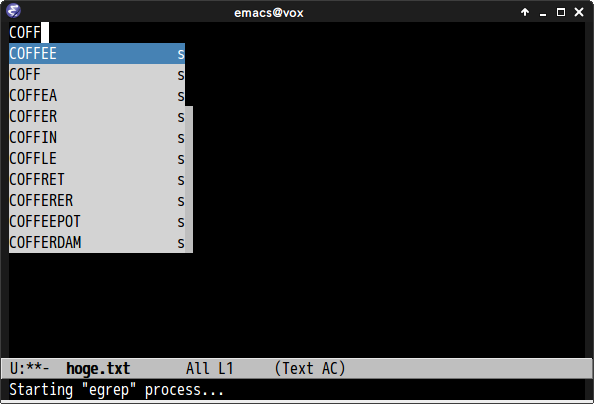
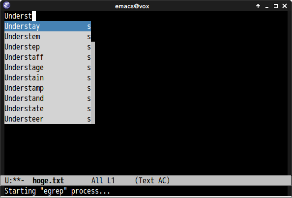

# ac-ispell.el [![melpa badge][melpa-badge]][melpa-link] [![melpa stable badge][melpa-stable-badge]][melpa-stable-link]

## Introduction

`ac-ispell.el` is ispell/aspell completion source for [auto-complete](https://github.com/auto-complete/auto-complete).
`ac-ispell` also supports **UPCASE** completion and **Capitalized** completion.


## Screenshot


### UPCASE Completion



### Capitalized completion




## Installation

`ac-ispell` is available on [MELPA](https://melpa.org/) and [MELPA stable](https://stable.melpa.org/)

You can install `ac-ispell` with the following command.

<kbd>M-x package-install [RET] ac-ispell [RET]</kbd>


## Requirements

- Emacs 23 or higher
- [auto-complete](https://github.com/auto-complete/auto-complete)
- ispell/aspell


## How to use `ac-ispell` completion source

You can call `ac-ispell-ac-setup` at hooks.

```common-lisp
(add-hook 'some-mode-hook 'ac-ispell-ac-setup)
```


## Commands

#### `ac-ispell-setup`

Declare ispell/aspell `auto-complete` source based on `ac-ispell-requires`.
The source name of auto-complete is `ac-source-ispell`.
This command must be called at the beginning.


#### `ac-ispell-ac-setup`

Setup ispell `auto-complete` source and enable `auto-complete-mode` if
`auto-complete` is not enabled.


## Set Other Dictionary

You can set other dictionary by setting `ispell-complete-word-dict`.

```lisp
(setq ispell-complete-word-dict "DictionaryFilePath")
```


## Customize Variables

#### `ac-ispell-requires`(Default `3`)

Required number of characters of this source completion.
You should change this value before calling `ac-ispell-setup`.

I recommend to use `custom-set-variables` for setting this value.


#### `ac-ispell-fuzzy-limit`(Default `2`)

Number of fuzzy completion candidates. If this value is `0`,
fuzzy completion is disabled.

#### `ac-ispell-cache-size`(Default `20`)

Cache size.


## Sample Configuration

```lisp
;; Completion words longer than 4 characters
(custom-set-variables
  '(ac-ispell-requires 4)
  '(ac-ispell-fuzzy-limit 2))

(eval-after-load "auto-complete"
  '(progn
      (ac-ispell-setup)))

(add-hook 'git-commit-mode-hook 'ac-ispell-ac-setup)
(add-hook 'mail-mode-hook 'ac-ispell-ac-setup)
```

[melpa-link]: https://melpa.org/#/ac-ispell
[melpa-stable-link]: https://stable.melpa.org/#/ac-ispell
[melpa-badge]: https://melpa.org/packages/ac-ispell-badge.svg
[melpa-stable-badge]: https://stable.melpa.org/packages/ac-ispell-badge.svg
